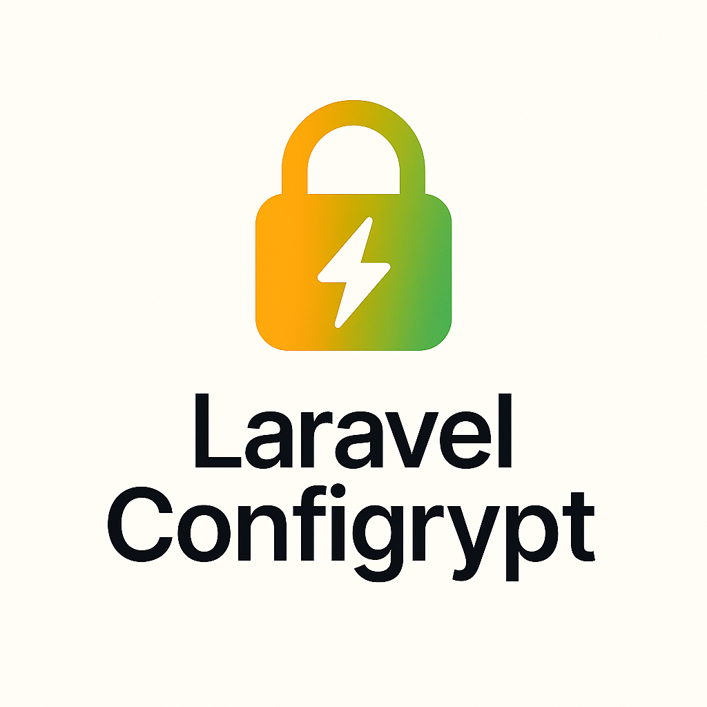

# Laravel Configrypt

<div align="center">
  
  <p><strong>Encrypt sensitive values in your Laravel .env file and decrypt them automatically at runtime — safe, seamless, and config-driven.</strong></p>

  [](https://packagist.org/packages/grazulex/laravel-configrypt)
  [](https://packagist.org/packages/grazulex/laravel-configrypt)
  [](LICENSE.md)
  [](https://php.net)
  [](https://laravel.com)
</div>

## 🔐 Overview

🔏 Laravel Configrypt lets you **encrypt secrets directly in your `.env` file** using a secure key, and automatically decrypts them when accessed via Laravel’s `env()` or configuration helpers.

It protects values like API tokens, database credentials, or secret keys — especially when sharing `.env` files across environments or storing encrypted configs in source control or CI/CD.

## ✨ Features

- 🔐 Encrypt `.env` values using AES-256
- 🔓 Transparent decryption at runtime
- 🔧 Seamless Laravel integration via service provider
- 🔑 Custom encryption key support (fallback to `APP_KEY`)
- 📦 Works with both `env()` and `config()` helpers
- 🛡️ Secure by default: decryption only happens inside app runtime
- ⚙️ Configurable via `config/configrypt.php`
- 🧪 Safe for CI/CD, secrets rotation, and external vault injection

## 💡 Example

In your `.env`:

```
MAIL_PASSWORD=ENC:gk9AvRZgx6Jyds7K2uFctw==
```

In your Laravel code:

```php
config('mail.password'); // returns decrypted value
env('MAIL_PASSWORD');    // returns decrypted value
```

## ⚙️ Configuration

Publish the config:

```bash
php artisan vendor:publish --tag=configrypt-config
```

Result in `config/configrypt.php`:

```php
return [

    // Use a dedicated key or fallback to APP_KEY
    'key' => env('CONFIGRYPT_KEY', env('APP_KEY')),

    // Prefix used to identify encrypted values
    'prefix' => 'ENC:',

    // Cipher method
    'cipher' => 'AES-256-CBC',

    // Automatically decrypt during config/bootstrap
    'auto_decrypt' => true,
];
```

## 🚀 Quick Start

### 1. Install the package

```bash
composer require grazulex/laravel-configrypt
```

### 2. Publish configuration (optional)

```bash
php artisan vendor:publish --tag=configrypt-config
```

### 3. Encrypt your secrets

```bash
php artisan configrypt:encrypt "my-super-secret-password"
```

Output:
```
Encrypted value:
ENC:gk9AvRZgx6Jyds7K2uFctw==

You can now use this encrypted value in your .env file:
SOME_SECRET=ENC:gk9AvRZgx6Jyds7K2uFctw==
```

### 4. Add to your .env file

```env
DB_PASSWORD=ENC:gk9AvRZgx6Jyds7K2uFctw==
API_SECRET=ENC:XyZ123AbC456DeF789GhI012JkL==
JWT_SECRET=ENC:MnOpQrStUvWxYzAbCdEfGhIjKl==
```

### 5. Use in your application

```php
// These will automatically return the decrypted values
$dbPassword = env('DB_PASSWORD');
$apiSecret = config('services.api.secret');
$jwtSecret = config('jwt.secret');
```

## 🔧 Advanced Usage

### Using the Facade

```php
use LaravelConfigrypt\Facades\Configrypt;

// Encrypt a value
$encrypted = Configrypt::encrypt('my-secret-value');

// Decrypt a value
$decrypted = Configrypt::decrypt('ENC:encrypted-value');

// Check if a value is encrypted
$isEncrypted = Configrypt::isEncrypted('ENC:some-value');
```

### Dependency Injection

```php
use LaravelConfigrypt\Services\ConfigryptService;

class MyController extends Controller
{
    public function __construct(private ConfigryptService $configrypt)
    {
    }

    public function encryptValue(Request $request)
    {
        $encrypted = $this->configrypt->encrypt($request->value);
        return response()->json(['encrypted' => $encrypted]);
    }
}

## 🔄 Auto-Decryption Behavior

When `auto_decrypt = true`, Laravel Configrypt will hook into the environment loading process, and decrypt all `ENC:` values transparently — no changes needed in your app code.

Supports:

- `env('KEY')`
- `config('service.key')` (if backed by env)

## 🧪 Practical Examples

### Database Configuration

```env
# Encrypt your database password
DB_PASSWORD=ENC:W3+f/2ZzZfl9KQ==
```

```php
// config/database.php - works seamlessly
'mysql' => [
    'driver' => 'mysql',
    'password' => env('DB_PASSWORD'), // Automatically decrypted
],
```

### API Keys Management

```env
# Third-party service credentials
STRIPE_SECRET=ENC:Nq8j8hlc3PMp9uE=
MAILGUN_SECRET=ENC:XYZ123456789abc=
AWS_SECRET_ACCESS_KEY=ENC:AbCdEf1234567890=
```

```php
// config/services.php
'stripe' => [
    'secret' => env('STRIPE_SECRET'), // Auto-decrypted
],
```

### Multi-Environment Setup

```bash
# Development
CONFIGRYPT_KEY=dev-key-32-characters-long-----
DB_PASSWORD=ENC:dev-encrypted-password

# Production  
CONFIGRYPT_KEY=prod-key-32-characters-long----
DB_PASSWORD=ENC:prod-encrypted-password
```

More examples available in the [`examples/`](examples/) directory.

## 🔑 Changing Keys

You can define a custom `CONFIGRYPT_KEY` in `.env` to use a dedicated encryption key different from `APP_KEY`.

> 💡 Remember: only encrypted values with the correct key can be decrypted. Keep your key safe!

## 🛡️ Security Considerations

- Decryption only happens in memory — encrypted values never touch disk after load
- `ENC:` prefix ensures only intended values are decrypted
- Best used with `.env.staging`, `.env.production`, or vault-managed `.env` overrides
- Ideal for sharing `.env` securely in teams or across pipelines

## 🚀 Quick Start

```bash
composer require grazulex/laravel-configrypt

php artisan vendor:publish --tag=configrypt-config

# Encrypt a secret
php artisan configrypt:encrypt "your-secret-value"

# Add to .env file
echo "MY_SECRET=ENC:your-encrypted-value" >> .env

# Use in your application
$secret = env('MY_SECRET'); // Automatically decrypted!
```

## 📚 Documentation

Comprehensive documentation is available in the [`docs/`](docs/) directory:

- **[Installation](docs/installation.md)** - Getting started with Laravel Configrypt
- **[Configuration](docs/configuration.md)** - Customizing encryption settings
- **[Basic Usage](docs/basic-usage.md)** - Fundamental encryption/decryption operations
- **[Advanced Usage](docs/advanced-usage.md)** - Complex scenarios and integrations
- **[Artisan Commands](docs/artisan-commands.md)** - Command-line tools reference
- **[API Reference](docs/api-reference.md)** - Complete API documentation
- **[Security Considerations](docs/security.md)** - Security best practices
- **[Troubleshooting](docs/troubleshooting.md)** - Common issues and solutions
- **[Examples](examples/README.md)** - Practical usage examples

## 📄 License

MIT License — see [LICENSE.md](LICENSE.md)

---

<div align="center">
  Made with 🔐 for Laravel developers who care about secrets.
</div>
